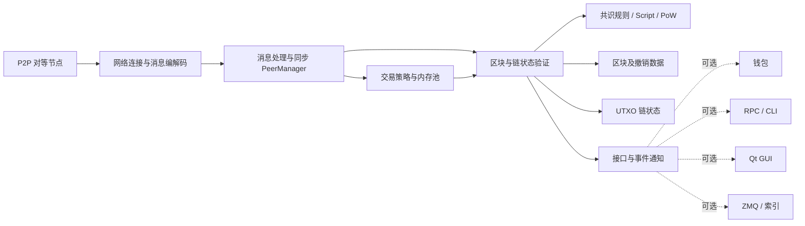

# 比特币基础框架与必需模块

## 1. 先明确讨论范围

本文讨论的是“一个能够独立验证比特币主链的 Bitcoin Core 全节点”需要什么，而不是交易所、区块浏览器或钱包 App 的完整产品架构。

Bitcoin Core 的核心职责可以概括为：

> 从 P2P 网络接收区块和交易，按照确定的共识规则独立验证它们，并把当前有效链表示为一套可持久化、可回滚的 UTXO 状态。

项目根目录的 [README](../README.md) 也明确说明：Bitcoin Core 会连接 P2P 网络，下载并完整验证区块和交易；钱包和图形界面可以选择不构建。

因此，理解框架时应区分三类内容：

1. **协议/共识必需**：缺失或实现错误会与其他节点产生不同的有效链结果。
2. **完整节点工程必需**：不属于共识规则，但没有它就无法成为可长期运行、可同步的节点。
3. **产品可选能力**：钱包、GUI、RPC、ZMQ、索引等，可以关闭而不影响节点验证共识。

## 2. 总体框架



最核心的数据流是：

```text
网络消息 -> 交易/区块反序列化 -> 基础检查 -> 共识与脚本验证
         -> 选择累计工作量最大的有效链 -> 更新/回滚 UTXO -> 持久化
```

## 3. 协议与共识层必须包含的内容

### 3.1 基础数据结构与确定性序列化

必须定义并稳定处理：

- 交易、输入、输出、见证数据和交易 ID；
- 区块头、区块、Merkle Root 和区块哈希；
- 金额、哈希、网络消息及磁盘数据的序列化格式；
- 字节序、边界检查、整数溢出和解码失败处理。

主要入口：

- [src/primitives/transaction.h](../src/primitives/transaction.h)
- [src/primitives/block.h](../src/primitives/block.h)
- [src/serialize.h](../src/serialize.h)
- [src/protocol.h](../src/protocol.h)

序列化必须是确定性的。节点如果对同一组字节解析出不同交易或区块，就不可能保持共识。

### 3.2 密码学基础

至少包括：

- SHA-256、双 SHA-256 等哈希运算；
- secp256k1 椭圆曲线签名验证；
- ECDSA、Schnorr/Taproot 所需验证能力；
- 安全随机数、密钥材料处理及验证缓存。

主要目录：

- [src/crypto](../src/crypto)
- [src/secp256k1](../src/secp256k1)

对全节点而言，**验证签名是必需的，持有私钥和创建签名不是必需的**；后者属于钱包能力。

### 3.3 Script 执行与花费条件验证

比特币输出不是简单的“账户余额”，而是由锁定脚本约束的 UTXO。节点必须验证输入是否满足被花费输出的条件，包括历史软分叉启用的脚本语义。

主要入口：

- [src/script/interpreter.cpp](../src/script/interpreter.cpp)
- [src/script/interpreter.h](../src/script/interpreter.h)
- [src/script/script.cpp](../src/script/script.cpp)

核心接口是 `VerifyScript(...)`。脚本版本、验证标志和软分叉激活高度必须严格一致，不能按本地偏好随意改变。

### 3.4 交易与区块共识规则

必须检查的规则包括但不限于：

- 输入引用的 UTXO 存在且没有被重复花费；
- 输入总额、输出总额、手续费和金额范围合法；
- Coinbase 结构、区块补贴和手续费领取合法；
- 区块重量、SigOps、锁定时间、序列号等限制；
- Merkle Root、见证承诺和交易顺序等区块结构约束；
- 各项软分叉规则是否在对应链状态下启用。

主要目录和文件：

- [src/consensus](../src/consensus)
- [src/consensus/tx_verify.cpp](../src/consensus/tx_verify.cpp)
- [src/consensus/merkle.cpp](../src/consensus/merkle.cpp)
- [src/consensus/params.h](../src/consensus/params.h)
- [src/validation.cpp](../src/validation.cpp)

### 3.5 工作量证明、难度和链选择

节点必须：

- 验证区块头的 PoW 目标；
- 按网络规则计算难度调整；
- 维护区块索引及父子关系；
- 选择累计链工作量最大的**有效链**，而不是区块数量最多的链；
- 在更强链出现时执行断开旧块、连接新块的链重组。

主要入口：

- [src/pow.cpp](../src/pow.cpp)
- [src/chain.h](../src/chain.h)
- [src/validation.cpp](../src/validation.cpp)

`Chainstate::ActivateBestChain(...)` 是最佳链激活的重要入口，`ConnectBlock`/`DisconnectBlock` 一类逻辑负责 UTXO 状态前进和回滚。

### 3.6 网络参数与创世块

不同网络必须隔离，并具有各自的：

- 创世块；
- P2P magic、默认端口和地址前缀；
- PoW/难度参数；
- 共识部署和激活条件；
- 检查点或 AssumeUTXO 等启动辅助数据。

主要入口：

- [src/chainparams.cpp](../src/chainparams.cpp)
- [src/kernel/chainparams.cpp](../src/kernel/chainparams.cpp)
- [src/consensus/params.h](../src/consensus/params.h)

## 4. 一个可运行完整节点必须包含的工程模块

### 4.1 P2P 网络与同步

节点必须具备：

- 入站/出站连接管理；
- 握手、能力协商、消息校验和限流；
- 区块头优先同步、区块下载和交易中继；
- 对等节点状态、超时、误行为和资源滥用防护；
- 初始区块下载及断线恢复。

主要入口：

- [src/net.cpp](../src/net.cpp)：连接、Socket 和节点生命周期；
- [src/net_processing.cpp](../src/net_processing.cpp)：协议消息处理、同步与中继；
- [src/net_processing.h](../src/net_processing.h)：`PeerManager`；
- [src/protocol.h](../src/protocol.h)：P2P 协议常量和消息类型。

网络层只负责“收到什么”；共识验证层负责“它是否有效”。不能因为消息来自可信节点而跳过验证。

### 4.2 UTXO 与链状态管理

UTXO 集是当前可花费输出的紧凑状态，而不是把所有历史交易每次重新扫描一遍。节点必须支持：

- 查询、缓存、添加和花费 UTXO；
- 连接新区块时原子更新状态；
- 保存撤销数据以支持链重组；
- 启动时加载、校验和恢复链状态；
- 崩溃或异常退出后的数据库一致性处理。

主要入口：

- [src/coins.cpp](../src/coins.cpp)
- [src/validation.h](../src/validation.h)：`Chainstate`、`ChainstateManager`、`BlockManager`；
- [src/node/chainstate.cpp](../src/node/chainstate.cpp)：链状态加载；
- [src/txdb.cpp](../src/txdb.cpp)：LevelDB 数据访问。

磁盘布局见 [doc/files.md](../doc/files.md)：`blocks/blk*.dat` 保存区块，`blocks/rev*.dat` 保存撤销数据，`blocks/index/` 保存区块索引，`chainstate/` 保存 UTXO 状态。

### 4.3 交易内存池与节点策略

未确认交易进入区块前通常保存在 mempool 中。节点需要处理：

- 交易共识检查；
- 标准性和本地中继策略；
- 祖先、后代及交易簇关系；
- 费率、容量限制和淘汰；
- RBF 替换；
- 新区块连接、链重组后的 mempool 更新。

主要入口：

- [src/txmempool.h](../src/txmempool.h)：`CTxMemPool`；
- [src/validation.cpp](../src/validation.cpp)：`AcceptToMemoryPool(...)`；
- [src/policy](../src/policy)；
- [doc/policy/mempool-design.md](../doc/policy/mempool-design.md)。

关键区别：

> 共识规则决定“区块是否有效”；mempool/中继策略决定“本节点现在是否愿意保存和转发一笔未确认交易”。

策略可以比共识严格，但不能把本地策略误当成区块共识规则。

### 4.4 持久化、缓存、剪枝和索引

长期运行节点还必须处理：

- 区块文件和索引数据库；
- UTXO 数据库及内存缓存；
- 安全刷盘和崩溃一致性；
- 磁盘空间管理与区块剪枝；
- 启动时校验、重建索引和重新索引。

交易索引、区块过滤器索引、UTXO 统计索引等属于可选加速能力，不参与判断区块是否有效。

### 4.5 生命周期、配置、日志和并发控制

工程上还需要：

- 参数与配置文件解析；
- 初始化各模块并按依赖顺序启动线程；
- 锁、队列和任务调度；
- 日志、告警、信号和优雅退出；
- 网络、数据库、钱包之间的抽象接口，避免循环依赖。

主要入口：

- [src/bitcoind.cpp](../src/bitcoind.cpp)：守护进程入口；
- [src/init.cpp](../src/init.cpp)：`AppInitMain(...)` 及整体初始化；
- [src/node/context.h](../src/node/context.h)：节点组件上下文；
- [src/interfaces](../src/interfaces)：节点、钱包和 GUI 的边界接口；
- [doc/design/libraries.md](../doc/design/libraries.md)：库分层和依赖方向。

## 5. 哪些内容不是核心必需

| 模块 | 是否为验证型全节点必需 | 说明 |
|---|---:|---|
| 钱包 | 否 | 管理密钥、地址、余额视图、选币、签名和交易创建；节点可用 `ENABLE_WALLET=OFF` 构建。 |
| Qt GUI | 否 | 图形交互层；`BUILD_GUI` 默认可关闭。 |
| JSON-RPC / CLI | 协议非必需，运维常用 | 不影响共识，但实际部署通常需要管理接口。 |
| ZMQ 通知 | 否 | 向外部程序发布区块/交易事件。 |
| 可选索引 | 否 | 改善查询能力，不改变验证结果。 |
| 挖矿 | 单个全节点不必需 | 全网必须有矿工产生新区块，但验证节点不需要自行挖矿。Bitcoin Core 可提供区块模板相关能力。 |
| 钱包私钥/签名 | 否 | 全节点只需验证签名，不需要拥有任何私钥。 |
| Mempool | 对离线区块验证非必需，联网节点实际必需 | 区块共识不依赖某个节点的 mempool，但交易中继和候选交易管理依赖它。 |

当前项目的构建开关也体现了这些边界：[CMakeLists.txt](../CMakeLists.txt) 中 `BUILD_DAEMON`、`BUILD_GUI`、`ENABLE_WALLET`、`WITH_ZMQ`、测试和工具均可独立控制。

## 6. 当前 Bitcoin Core 31.1 的代码分层

结合 [doc/design/libraries.md](../doc/design/libraries.md)，可以把代码大致分为：

| 层 | 主要库/目录 | 职责 |
|---|---|---|
| 基础设施 | `crypto/`、`util/`、`common/` | 密码学、平台封装、通用类型和工具 |
| 共识 | `consensus/`、`script/`、`primitives/` | 交易/区块数据、脚本和共识规则 |
| 验证内核 | `kernel/`、`validation.*`、`coins.*` | 区块验证、最佳链、UTXO 和链状态 |
| 节点 | `node/`、`net.*`、`net_processing.*`、`txmempool.*` | P2P、同步、mempool、RPC 服务与节点编排 |
| 接口 | `interfaces/` | 隔离 node、wallet、GUI，避免相互直接依赖 |
| 钱包 | `wallet/` | 密钥、地址、交易构造、选币和钱包数据库 |
| 展示与集成 | `qt/`、`rpc/`、`zmq/` | GUI、远程管理和事件通知 |

其中 `libbitcoin_consensus` 和 `libbitcoinkernel` 更接近“验证核心”，`libbitcoin_node` 在其上增加 P2P 和节点服务；`libbitcoin_wallet` 与 `libbitcoinqt` 不应成为共识验证的反向依赖。

## 7. 建议的源码阅读顺序

不要从 `validation.cpp` 第一行直接硬啃。推荐按数据流阅读：

1. **交易与区块长什么样**：`primitives/transaction.h`、`primitives/block.h`。
2. **网络参数是什么**：`chainparams.cpp`、`consensus/params.h`。
3. **脚本如何验证**：`script/interpreter.h/.cpp`。
4. **UTXO 如何表示**：`coins.h/.cpp`。
5. **区块如何进入最佳链**：定位 `ProcessNewBlock`、`ActivateBestChain`、`ConnectBlock`、`DisconnectBlock`。
6. **P2P 如何把数据交给验证层**：`net_processing.cpp` 和 `PeerManager`。
7. **最后看启动装配**：`bitcoind.cpp`、`init.cpp`、`node/context.h`。

钱包、RPC 和 Qt 建议在理解节点验证主链以后再读，否则容易把“用户界面行为”与“比特币共识规则”混在一起。

## 8. 最小完整节点的验收标准

如果从零实现一个最小验证节点，至少应证明：

- 能解析并校验网络消息、区块和交易；
- 能从创世块开始同步区块头和区块；
- 能验证 PoW、难度、交易、Script、补贴及全部已激活共识规则；
- 能维护 UTXO，并拒绝双花；
- 能按累计工作量选择有效链并正确执行重组；
- 能持久化区块、区块索引、撤销数据和 chainstate；
- 重启后能恢复到一致状态；
- 对畸形输入和资源消耗攻击有边界保护；
- 与已知有效/无效区块测试向量及其他实现保持一致。

仅仅做到“能收发交易”“能显示区块”或“能创建钱包”都不能称为完整验证节点。

## 9. 一句话抓住核心

比特币节点的本质不是保存一张账户余额表，而是：

> 用统一的共识规则验证一条累计工作量最大的区块链，并通过可回滚的 UTXO 状态记录这条链当前允许花费的输出。

